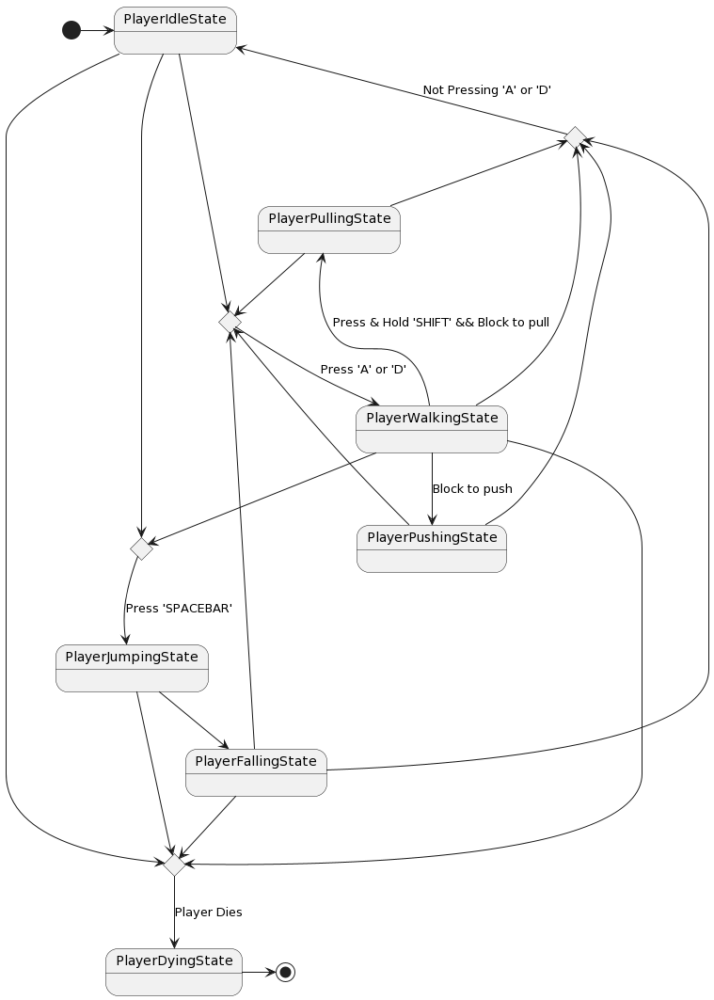
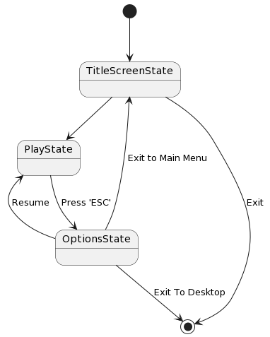
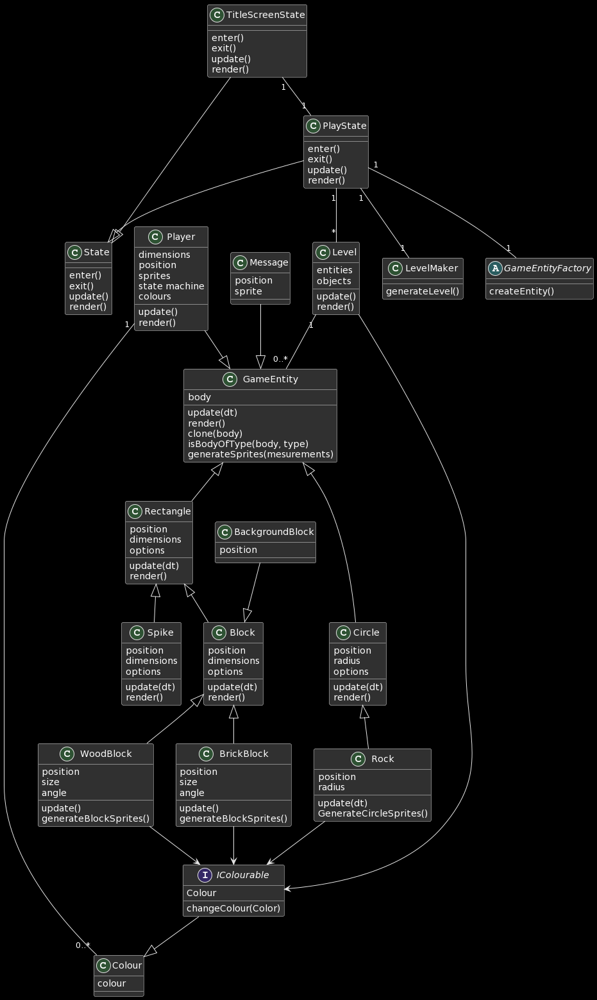

# Game Programming F22 Project - Pokémon the Trading Card Game

## ✒️ Description
In this side-scroller puzzle platformer, the player goes through the story trying to collect to find his mother that got lost in the colour world. The player goes through story levels in order to gain plot sensitive information about his mother's retelling of how she dissapeared as well as puzzle levels, where the player uses new found colours to solve puzzles. Puzzle levels have different elements that interact with the player. There are falling stones that interact with the environnement, coloured bricks that dissapear when they match the background colour, spikes that kill the player and many more.

## 🕹️ Gameplay

The game works by interacting with colours that the player slowly collects. Once a player has collected a colour, they can switch to that colour, which then switches the background colour. Any object that implements the colour mechanic will only be interactable and rendered if they are not the same colour as the background. 

The game starts off by spawning the player into a main level, where all the other levels can be accessed from. The player can go from one level to the next by interacting with doorways. These doorways implement the colour mechanic, where the player can only go through a doorway that is a different colour than the background. This starter level has different coloured elements that block the user from progressing too far. These are also implemented using the colour mechanic, whereas the player will not be able to switch to these not yet unlocked colours, therefore blocking the doorways to the later levels. By only allowing the player to go through one doorway, they are then bound to a set path. As the player progresses, the already completed levels become fully replayable.

There are two types of levels the player will come across. Story levels and puzzle levels. The story levels are just a long winding paths that force the player to listen to the story audio or read the subtitles. These levels are designed to be longer than the audio tracks so that a player cannot skip through the story. These long levels usualy end in doorway leading to a puzzle level or a new colour room where the player unlocks a new colour. Puzzle levels on the other will alow the player to interact with the environnement and use the colours they have collected to solve a puzzle. These start off easy and more platform like and slowly become more neuron intensive. As the levels progress, the player will come across new mechanics that keep the game fresh. These range from spikes on the ground and ceiling that kill the player, rocks that roll and fall that can crush the player, wooden blocks that the player can push or pull as well as bricks and more. Any of these elements can also implement the colour mechanic, where they will not be interactable or rendered if they are the same colour as the background. This variety of mechanics allows the game to offer a large combination of puzzles to the player therefor increasing the fun factor.

The death mechanic resets the current room the player is in and sets them back to the start. In a story level, this will reset any audio or visual queues and in a puzzle room will reset any puzzle progress. This mechanic can be strategically used to reset a level.

The game ends when the player has collected all the colours and has found either their mom or the meaning or colours. (i can't remember)

## 📃 Requirements

1. The user shall press a key when on the title screen to enter the game
2. The system shall load the game at the previously saved point
3. The user shall be able to do the following actions:
    - Press the ’A’ key to move left
    - Press the ‘D’ key to move right
    - Press the ‘SPACEBAR’ key to jump
    - Press a number key to switch to that corresponding colour
    - Press the ‘LSHIFT’ to interact with an interactable environment object
    - Press & Hold the ‘LSHIFT’ key to pull a wooden crate
    - Push a rendered wooden crate by walking into it, as long as there is nothing blocking it from going in that direction
    - Press the ‘W’ key to walk through a valid doorway
4. Spikes should kill the player if they come into contact with each other
5. Rocks and crates should kill the player if they are in movement and come into contact with the player.
    - These should not kill the player if they being moved by the player or underneath the player
6. Player death should reset the current room and reset the player to the start of that room
7. Environment objects that implement the colour mechanic should only be interactable and rendered if they are not the same colour as the background.
8. The starting colour of a room is set by the colour of the doorway into that room
9. The system shall:
    - Render the correct level
    - Handle environnement object forces and movement
    - Handle player input
    - Output the correct sprites and audio
    - Reset the level upon player death

### 🤖 State Diagram

##### Player States Diagram

##### Game States Diagram

### 🗺️ Class Diagram

### 🧵 Wireframes

This is the title screen for the game. We will most likely make it simpler since we haven't figured out how to get access to these assets but it will say hue at the top and have some sort of color changing effect as well as text saying "Press any key to start".

This is what the general game will like. The floor, ceiling and walls will always be black but the background can be grey or any of the game colors. This is what a door will look like.

- Here is an example of what a blocks and spikes will look like. 

This is an example of subtitles that will be shown in story levels.

The player is picking up a new color on top of a triangle staircase.

This is the paused menu however we will have the following options instead:

- Resume
- Restart level
- Title Screen

### 🎨 Assets

For assets we are going to use a combination of game sprites and assets from itch.io.

Here are some examples from itch that we might use:

- https://i-am-44.itch.io/free-1-bit-dungeon-tileset
- https://edermunizz.itch.io/1-bit-pixel-art-forest

We used screenshots directly from the game as wireframes. 

The GUI will be kept extremely simple as it is virtually non existent while playing other than the options menu and hints for which buttons to use at the start of the game.

#### 🖼️ Images

- The only image we will use is for the title screen and we will take that from the hue site: https://www.huethegame.com/, or from the game files if we can find one that is better resolution.

#### ✏️ Fonts

The font used in the game is called Mozzart Sketch Regular:

- [Mozzart Sketch Regular](https://www.huethegame.com/fonts/posterizer_kg_-_mozzartsketchregular-webfont.woff2)

#### 🔊 Sounds

- Most of the sounds will be taken from the game files.
- If we need any extra sounds they will be taken from a royalty free sound website such as [Pixabay](https://pixabay.com/sound-effects/)

### 📚 References

- [Hue](https://www.huethegame.com/)

